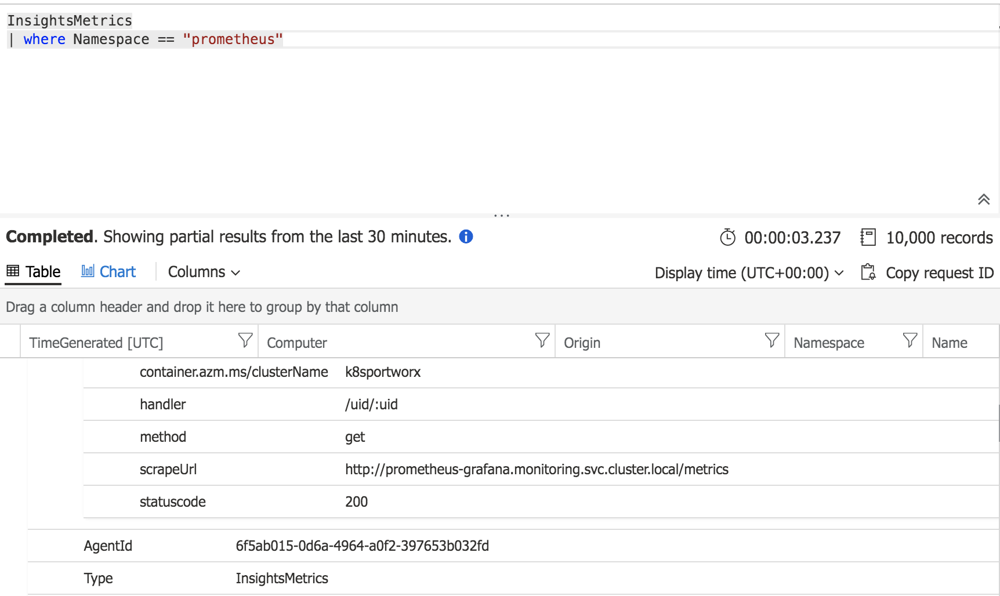

### Prometheus to Azure Monitor
```bash
wget -O container-azm-ms-agentconfig.yaml \ 
    https://raw.githubusercontent.com/microsoft/OMS-docker/ci_feature_prod/Kubernetes/container-azm-ms-agentconfig.yaml

```
Enable simple service to monitor
```yaml
        # An array of Kubernetes services to scrape metrics from.
        kubernetes_services = ["http://prometheus-grafana.monitoring.svc.cluster.local/metrics"]
```


```
 kubectl apply -f container-azm-ms-agentconfig.yaml 
```

